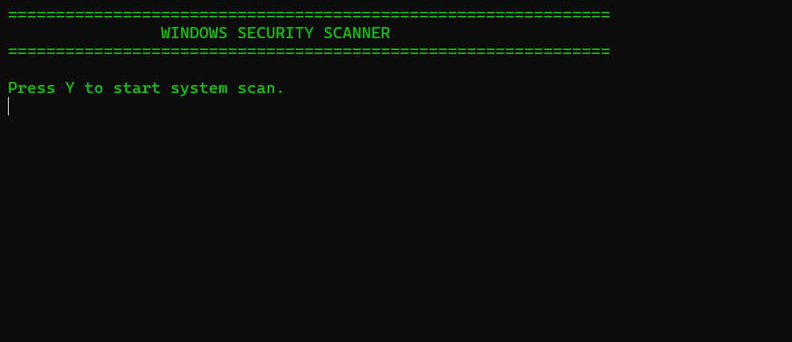
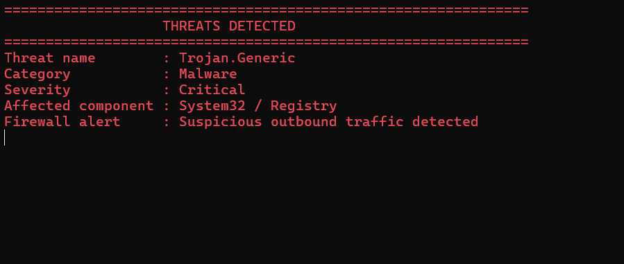
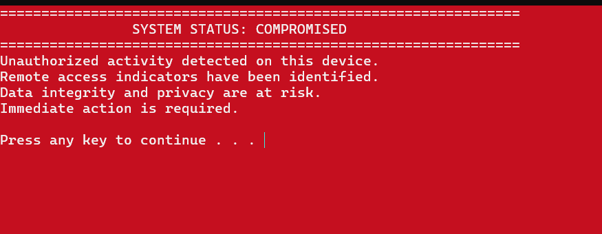

# ⚠ Windows Batch File Awareness Demo

## 🚨 Purpose

This project demonstrates how a simple `.bat` file can simulate a realistic Windows Security scan.

The goal is to spread cybersecurity awareness and show why users should never execute unknown batch files.

---
---

## 📸 Screenshots

### 🔹 Scan Start Screen

---

### 🔹 Threat Detection Screen

---

### 🔹 System Compromised Screen

## ❗ Important Notice

This script:

- ❌ Does NOT delete files
- ❌ Does NOT modify the system
- ❌ Does NOT access registry
- ❌ Does NOT connect to the internet
- ❌ Does NOT shut down the computer

It is completely harmless and created for educational purposes only.

---

## 🎯 Why This Project Matters

Many real cyber attacks begin with:

- Unknown email attachments
- Fake cracked software
- Unverified GitHub scripts
- USB drive files
- Social engineering tricks

If a harmless script can look real,
imagine what a malicious script can do.

---

## 🛡 Cybersecurity Advice

Before running any file:

- ✔ Scan it using VirusTotal
- ✔ Open and inspect code in Notepad
- ✔ Verify the source
- ✔ Use a virtual machine or sandbox
- ✔ Never blindly trust `.bat`, `.vbs`, `.ps1`, or `.exe` files

---

## 👨‍💻 Educational Project

Created for cybersecurity awareness and learning purposes.
